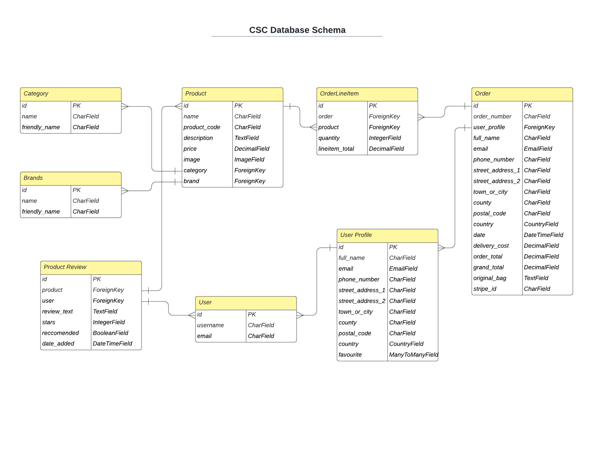

# Cardiff Skatebord Club  

[View deployed site here](https://cardiff-skateboard-club.herokuapp.com/)

## __Table of Contents__
1. [Introduction](#introduction)
2. [User Stories](#user-stories)

3. [Design](#design)
4. [Wireframes](#wireframes)
5. [Layout and Features](#layout-and-features)
6. [Features left to implement](#features-left-to-implement)
7. [Database](#database)
8. [Testing](#testing)
9. [Deployment](#deployment)
10. [Technologies Used](#technologies-used)
11. [Credits](#credits)
12. [Media and Content](#media-and-content)
13. [Acknowledgements](#acknowledgements)

## Introduction
CSC or 'Cardiff Skateboard Club' was founded originally in 2008 by a group of local skateboarders, as a sort of informal club/collective, and is a way for like minded people to get together, socialize organise events and above all ride skateboards. When Cardiff's famous City Surf store closed in 2016, Cardiff Skateboard Club was able to fill that void and have been successfully running a skate shop from the centre of Cardiff ever since. The good folks at CSC were kind enough to allow me to base my MS4 project on their store, they have provided me with a selection of products complete with images, prices and descriptions as well as use of their logo and some additional decorative images. From this I have built a functioning e-commerce store, that organises and showcases the available products and allows user to view and purchase them directly.

## User stories
Here I will address the aims and goals of the store from both the perspectives of a new user, registered user and of the owner.

### As a new user I want to
* Quickly and easily understand the purpose of the site to decide if I want to stay
* Have clear navigation tools to move around the site to find what I am looking for easily
* *Be able to prowse the full range of available products to decide if there is something I wish to purchase
* Be able to filter the products by their specific categories or brands so I can browse a particular brand or category I am looking for
* Search for items in the shop by their name or description so I can easily find items I am looking for
* Sort the items in the shop by price, name, brand and category to find items within my budget, or within my desired brand/category
* View individual product details to decide if a product meets my needs
* See product reviews and ratings from other users, so I can buy an item with confidence
* Add items to my bag easily so that I can continue to browse the store and make further purchases
* View my bag, and make adjustments to it before I check out, to enjoy a convenient and pleasant experience
* Create an account easily so I cake purchases and save my details for future use
* Have my performed actions confirmed to me so I am sure my intended action was completed
### As a registered user I also want to
* Easily log in or out so I can view my personal profile
* Be able to save and remove items to a wishlist so I can decide if I want purchase them later
* View and edit my delivery and account details to ensure my details are correct
* Edit my reviews so that I can ensure the reviews are correct
* View my purchase history so I can keep track of past orders
* Receive confirmation emails following a purchase so I know the purchase was successful
### As the site owner I want
* Be able to add, edit or delete products to keep the store updated
* Ensure that only superusers are able to add, edit or delete products in order to maintain control of the items in the store
* Be able to delete a users review in case it may be inappropriate or unfair.

## Design

### Overview

* Mobile first, user friendly design
* Intuitive layout, easy to navigate
* Users led through the store, aided by coherent and consistent navigation and signposting
* Users guided towards the store, aided to find the products they want, then guided to the checkout or back to the store to continue shopping.
* Minimal design aesthetic to ensure the site is clean and uncluttered, and not distracting or confusing for shoppers.
* Use of icons where applicable, but in keeping with a minimalist design aesthetic
* Design adheres to current norms and conventions e.g clear navigation, icons.
* Accessibility – content is accessible to as many users as possible – clear text, sufficiently contrasted to the background, ‘alt’ tags and ‘aria’ labels used appropriately.

### Colours

 source www.coolers.co
* The main background of the site will be white. This is to keep things neutral and uncluttered (#FFFFFF). The product images are so colorful and vibrant that it would be distracting to have too many colours and textures vying for the user's attention, and would not enhance the user experience and potentially affect a decision to purchase.
* I have used a light grey color (#E9ECEF) to separate areas of the site areas, such as the header and footer and for forms and where there is a lot of information presented such as the 'product detail' page.
* Bootstrap cards and a shadow effect have also been used for the same purpose on the 'products' page.
* The main recurring color in the design is a bright pink (#F53DA2) which is used to inject some colour and vibrancy into the design in keeping with the skateboarding culture.
* The pink also used to subtly donate a positive action, e.g the 'buy now' button, 'add to favorites' etc. Whereas less positive actions such as 'go back', 'previous' or 'cancel' have a plain black/white aesthetic.
* Pink is also used as a hover effect on links, for review stars, and to animate the shopping bag when it contains items.

### Fonts

* The site exclusively uses [Assistant](https://fonts.google.com/specimen/Assistant) for its neutral and factual aesthetic.
* If unavailable the browser is set to default to 'Helvetica' or any sans serif.
* Text color will be plain black.

### Bootstrap

* I have used the CSS framework Bootstrap to achieve a design consistency across the site. Bootstrap's responsive breakpoints have been utilised to ensure the site layout is responsive across all viewports and devices
* I have used customised Bootstrap's modals, cards, alerts, toasts, forms and responsive navbar, throughout the site to achieve a uniformity of design that is visually pleasing and responsive.

### Buttons
* The majority of the sites button have been customised from Bootstrap, with pink 'outline' buttons used to denote forward or positive actions while black outline buttons have been used for negative or returning actions.
* All buttons have square corners for a clean uniformity, and a pink hover effect to confirm the action to the user.

### Images
* Images are predominantly of the products. Skateboarding products are incredibly vibrant and provide most of the colour for the site.
* The homepage has a 'hero' image which is overlayed with the CSC logo to quickly establish the nature of the site.
* Other general images and artwork (provided by CSC) are used to animate the homepage.

### Icons
* Remix Icon's have been used for their clean aesthetic and simplicity, to convey meaning quickly to users and to keep the design minimal. Notably they are used for the 'search' 'user profile' and 'bag' links in the navbar as well as a heart for the user favorites/wishlist,   rating stars and social media footer links.

### Wireframes
* My initial wireframes can be seen [here](media/readme-images/wireframes.png)
* The layout of the site has been largely governed by the accepted norms of a modern e-commerce store

&nbsp; &nbsp; &nbsp; &nbsp; &nbsp; &nbsp; &nbsp; &nbsp; &nbsp; &nbsp; &nbsp; &nbsp; &nbsp; &nbsp; &nbsp; &nbsp; &nbsp; &nbsp; &nbsp; &nbsp; &nbsp; &nbsp; &nbsp; &nbsp;&nbsp; &nbsp; &nbsp; &nbsp; &nbsp; &nbsp; 
&nbsp; &nbsp; &nbsp; &nbsp; &nbsp; &nbsp; &nbsp; &nbsp; &nbsp; &nbsp; &nbsp; &nbsp; &nbsp; &nbsp; &nbsp; &nbsp; &nbsp; &nbsp; &nbsp; &nbsp; &nbsp; &nbsp; &nbsp; &nbsp; &nbsp;[Back to Top](#table-of-contents)

## Layout and Features

### Site Header and Footer
* CSC logo in the top left that links to the home page
* Navigation menu is positioned centrally and includes a series of dropdown menus that allow users to filter products by type or brand, as well as to order the products by price and category.
* On the far right of the navbar are search, user and bag icons.
* Search Icon reveals a hidden search bar to reduce screen clutter, particularly on mobile.
* Search bar allows users to search the products by name and description.
* If users are logged in the user icon reveals a dropdown menu which links to the users dashboard and an option to log out of the site.
* If the user is a Site Admin they will lsao be shown a link to the 'product admin' page.
* If the user is not logged in the dropdown will show the option to login to the site or to register an account.
* Bag icon links to the users shopping bag and is pink if there are items in the bag. The number of items is also shown to the user.
* Footer displays the social media icons (for demonstration, not currently active)

### Home Page
* Users are shown a hero image of a skateboarder and the CSC logo and a short introductory paragraph to immediately make the purpose of the site clear.
* Users are shown a link to learm more about CSC, and a  'Shop Now' button that takes them to the 'Products' page so that they can start browsing the store right away.
* Below this a series of 3 colourful images link to diffrent products in the store.
* There is a nother short paragraph about CSC and an image to encourage supporting local independant shops.

### Products Page
* Products are laid out in a convenient grid style which stacks nicely on mobile devices.
* Users are able to use the menus in the navbar to filter products by categories or brands.
* Users can then sort the items in order by price, name, brand or category by clicking the relevant buttons.
* An information box displays the amount of products the user is viewing and also informs them of the results if they have searched for a product. 
* Each product has an image aand some key information underneath, including the average rating of the product.
* Users are able to add a product to their wishlist by clicking on the heart icon.
* Users are invited to click the 'See More' button which links to the 'product details' page.

### Product Details Page
* Users are shown all the information pertaining to each product
* Page split into 3 distinct sections to display this information to the user.
* The top section contains a large product image and other key information such as price, rating and how many users have recommended the product.
* Users are able to add/remove products to/from their wishlist.
* Site admins are able to edit or delete individual products. 
* The middle section allows users to select the desired number of a particular item and add it to their shopping bag.
* Confirmation messages are used to confirm the users actions. 
* On adding to their bag users are shown a 'toast' which summarises their bag contents, and offers them a link to view their bag.
* In the bootom area the users can view any reviews left by other users.
* Registered users can leave a product review, and also edit their own reviews.
* Site admin users can edit or delete reviews.

### Bag Page
* Users are shown a nice summarised list of the items in their bag
* Users are able to adjust the quantiy of each item in their bag or remove them completely.
* Users are shown the grant total of their items and any shipping costs as well as how much more they need to spend to reveive free shipping (if applicable).
* User are given the option to checkout or to keep shopping.

### Checkout Page
* Users are presented with nicely laid out form to complete in order to submit their personal, delivery and payment details.
* Summarise details of the priducts being purchased and the grand total are shown.
* If users are returning customer their delivery details are pre-poulated for convenience.
* Registered users are able to save their details to their profile, and un-registered users are given the option of creating an account in order to do so.
* Users are warned on how much their card will be charged.
* Bootstrap 'spinner' used to inform customers that their payment is being processed.
* Security, payment errors, and card payments are handled via integration with 'Stripe' payments.
 
### Checkout Success
* Users are presented with a 'toast' message to confirm their order was succesul and that a confirmation email has been sent.
* A detailed order summary is presented, and then saved to the user's profile if applicable for them to view.
* Users are given a convenient linkback to the store so they they can 'Keep Shopping!'.

### User Dashboard
* Convenient area for registered users to acces all the features associated with their account.
* Users can view and update their their details.
* View their order history, where they can view specific details of individual oreders and link to the products themselves in case they want to re-order.
* View their wishlist, where users can remove items, or head to the product detaiuls page in order to purchase the item.

### Product Admin
* Users with site admin access can add new products to the site, as well as edit and delete existing ones from the product details page.

### Additional Features

#### User Reviews/Ratings
* Users can add reviews of products, which incluse a description, star rating and whether they recommend the product. 
* This information is presented for other users in various ways across the site.
* Users can edit their own reviews, and site admins can edit or delete any review.

### User Wishlist
* Users are able to add and remove products from a whishlist which is linked to their profile.
* Users can click a heart icon to add/remove an item from the products page, or via a button on the product detail page.
* View all saved items in within tgheir dashboard.

### Messages
* Django's message framework used in conjunction with Bootstarp toasts to provide confirmation messages to user actions.
* Info, Success, Warning and Error tags have been utilised to give the user consistent feedback.

### Defensive Programming
* Defensive programming principles employed throughout the site.
* Default image is loaded if a product image is not available or cannot be loaded.
* Django's @login_required decorater is used to ensure certain features are are only available to registered users. 
* Users re-directed to the login page where applicable.
* Further controls have been implemented programatically through the backend to ensure only site admin users can add, edit or delete products or delete reviews.
* Account security covered by Django's 'allauth'.
* Django form and image validation ensures inputs do not compromise the database.
* Payment processing and securtiy covered by 'Stripe".
* Bootstrap modals used to force amin users to confirm that they  are happy to delete a product or a review.
* Custom 404 and 500 error pages displayed if displayed if a page can't be found.
* Button and menu links on the error pages so user can easily return to the site.

## Features left to Implement
* More skateboarding news/information/blogs links to events etc to promote the community based ethos of CSC.
* Users can sign up to a mailing lst to be informed about special offeres or discounts.
* Site admin feature to offer sale discounts on certain products/brands.
* Users are shown 'suggested' products based on the products they have been viewing.
* Social media integration to allow users to register easily and to share purchases, and increase sales.
* Implement Ajax integration to reduce the number of site 're-loads' to ensure a better user experience.
* Pagination on the proucts page. I was able to get this working but at the expense of effective product filtering. With more time it would be a nice feature to have. More details in [TESTING.md](TESTING.md) 

&nbsp; &nbsp; &nbsp; &nbsp; &nbsp; &nbsp; &nbsp; &nbsp; &nbsp; &nbsp; &nbsp; &nbsp; &nbsp; &nbsp; &nbsp; &nbsp; &nbsp; &nbsp; &nbsp; &nbsp; &nbsp; &nbsp; &nbsp; &nbsp;&nbsp; &nbsp; &nbsp; &nbsp; &nbsp; &nbsp; 
&nbsp; &nbsp; &nbsp; &nbsp; &nbsp; &nbsp; &nbsp; &nbsp; &nbsp; &nbsp; &nbsp; &nbsp; &nbsp; &nbsp; &nbsp; &nbsp; &nbsp; &nbsp; &nbsp; &nbsp; &nbsp; &nbsp; &nbsp; &nbsp; &nbsp;[Back to Top](#table-of-contents)

## Database 

A relational database was used for this project. It was the obvious choice given the number of relationships that exist betwwen the different datasets. During the development phase SQlite was used, and then once the project had been deployed to Heroku Postgres was used.
 

The following is a brief explanation of how the various models in the databse interact: 

### Product
* Holds all the key information relating to each product.
* Links to the Category model in order that each product falls within its given category.
* Links to the Brands models as each product has a brand type.
* Also links to the Product Review model so that reviews are linked to specific products.

### Category
* Stores details of each product category.
* links to the product table in so that each product has a given category.

### Brands
* Stores details of each product brand.
* links to the product table in so that each product has a particulare brand.

### ProductReview
* Holds information relating to each product review.
* Links to the user model so that each review is linked to a specifc user.
* Also links to the product model as each review is tied to a specific product

### OrderLineItem
* Links the product model to the order model
* Pulls the relevant product information which is added to the users order

### User 
* Created when a user registers an account
* Holds basic user info and links to the user profile model as well as to the product review model.

### UserProfile
* links to the user model
* Stores delivery details and the users wishlist.
* User wishlist links to the product model via a ManyToManyField as many users may have many products added to their wishlist.
* Also provides user information to the order model.

### Order 
* This model stores the complete order information.
* Pulls product information via the OrderLineItem model.
* Pulls user information from the UserProfile model

## Testing

You can view my separate TESTING.md file [here](TESTING.md)

## Deployment

## Technologies Used

### Languages
* [HTML](https://developer.mozilla.org/en-US/docs/Learn/HTML) 
* [CSS3](https://developer.mozilla.org/en-US/docs/Web/CSS) 
* [Javascript](https://www.javascript.com/)
* [Python](https://www.python.org/)

### Frameworks
* [Django](https://www.djangoproject.com/)
* [Bootstrap](https://getbootstrap.com/) 
* [JQuery](https://jquery.com/) 

### Other
* [Popper.js](https://popper.js.org/) 
* [PIP3](https://pip.pypa.io/en/stable/)
* [dnspython](https://www.dnspython.org/)
* [RandomKeyGen](https://randomkeygen.com/)
* [Responsinator](https://www.responsinator.com/)
* [AmIResponsive](http://ami.responsivedesign.is/)
* [Git](https://git-scm.com/) 
* [Github](https://github.com/) 
* [Gitpod](https://www.gitpod.io/) 
* [Heroku](https://www.heroku.com/)
* [Balsamiq](https://balsamiq.com/)
* [Pillow](https://pillow.readthedocs.io/en/stable/)
* [BOTO3](https://boto3.amazonaws.com/v1/documentation/api/latest/guide/quickstart.html)
* [AWS](https://aws.amazon.com/cli/)
* [Stripe](https://stripe.com/gb)
* [Google Chrome DevTools](https://developer.chrome.com/docs/devtools/)
* [Google Lighthouse](https://developers.google.com/web/tools/lighthouse)
* [Google Fonts](https://fonts.google.com/) 
* [Font Awesome](https://fontawesome.com/) 
* [Remixicon](https://remixicon.com/)
* [Photoshop](https://www.photoshop.com/en) 
* [LucidChart](https://www.lucidchart.com/)
* [CSVtoJson](https://gist.github.com/pamelafox/1878143)
* [W3C - HTML Validation](https://validator.w3.org/) 
* [W3C - CSS Validation](https://jigsaw.w3.org/css-validator/) 
* [JSHint](https://jshint.com/)
* [AutoPrefixer](https://autoprefixer.github.io/) 
&nbsp; &nbsp; &nbsp; &nbsp; &nbsp; &nbsp; &nbsp; &nbsp; &nbsp; &nbsp; &nbsp; &nbsp; &nbsp; &nbsp; &nbsp; &nbsp; &nbsp; &nbsp; &nbsp; &nbsp; &nbsp; &nbsp; &nbsp; &nbsp;&nbsp; &nbsp; &nbsp; &nbsp; &nbsp; &nbsp; &nbsp; &nbsp; &nbsp; &nbsp; &nbsp; &nbsp; &nbsp; &nbsp; &nbsp; &nbsp; &nbsp; &nbsp; &nbsp; &nbsp; &nbsp; &nbsp; &nbsp; &nbsp; &nbsp; &nbsp; &nbsp; &nbsp; &nbsp; &nbsp; &nbsp;[Back to Top](#table-of-contents)

## Credits

* This project was created from a [Code Institute](https://codeinstitute.net/) student template
* Initial outline for the site's functionality has been adapted from the [Boutique Ado](https://github.com/ckz8780/boutique_ado_v1) walkthrough project by Chris Zielinkski.
* Code adapted from
    * [Very Academy](https://www.youtube.com/watch?v=OgA0TTKAtqQ) - User wishlist 
    * [Code With Stein](https://www.youtube.com/watch?v=MgCRkbRTgtM) - Ratings/reviews
    * [Codemy](https://www.youtube.com/watch?v=N-PB-HMFmdo) - Pagination

* General deas and knowledge gleamed from: 
  * [Django Docs](https://docs.djangoproject.com/en/3.2/)
  * [W3 Schools](https://www.w3schools.com/)
  * [CSS-Tricks](https://css-tricks.com/)
  * [Bootstrap](https://getbootstrap.com/)
  * [Stack Overflow](https://stackoverflow.com/) - (specific credits have been added as comment in the code)
  * [MDN](https://developer.mozilla.org/en-US/)

 
  

