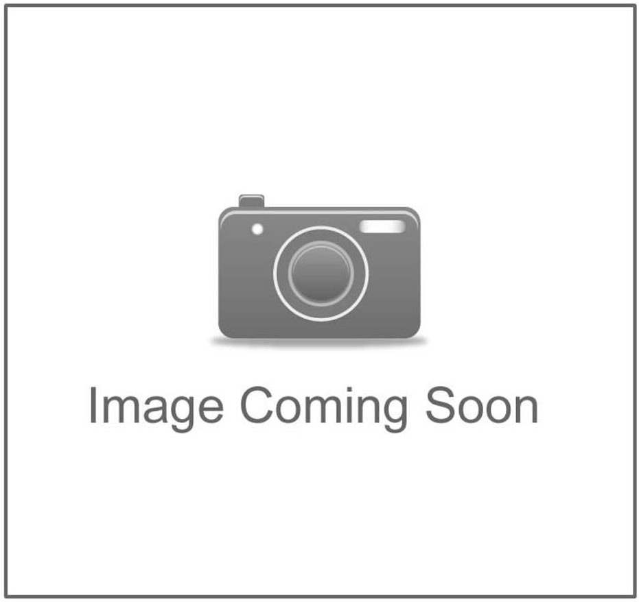

## User Stories

### ___As a new user I want to:___

* Quickly and easily understand the purpose of the site to decide if I want to stay
    * Introductory paragraph underneath the hero image introduces the site and explains its purpose
    * Hero images and site logo show the site's purpose.

 

* Have clear navigation tools to move around the site to find what I am looking for easily
    * Clear navigation bar at the top each page containing links to the products.
    * Icons in the top right corner of the navbar, provide quick navigation to key areas, bag, dashboard etc
    * Numerous navigation buttons on various pages allowing users to find their way around the site
    * Back to top button on the products page allows users to return to the top of the page quickly
    * Dropdown menus used to keet screen 'clutter' to a minimum.

* Be able to browse the full range of available products to decide if there is something I wish to purchase
    * Products page allows users to browse the full range of products.
    
* Be able to filter the products by their specific categories or brands so I can browse a particular brand or category I am looking for
    * Filter buttons/dropdown menu allows users to filter the results by category or brand and find the items they are interested in quickly.

* Search for items in the shop by their name or description so I can easily find items I am looking for
    * Users are able to click the search icon on all pages and search through the product range by name and description

* Sort the items in the shop by price, name, brand and category to find items within my budget, or within my desired brand/category
    * Convenient drpdown selector on mobile and filter buttons on desktop allow users to determine the order in which the products are listed

* View individual product details to decide if a product meets my needs.
    * Users can view the specifics of individual products on the product details page.
    * Price, product details and other information presented clearly to the customer.

* See product reviews and ratings from other users, so I can buy an item with confidence.
    * On the products page users can see the average rating of each product (if it has been rated)
    * On the product details page users can see the ratings, and how many customers have recommended the product.
    * Users can also read individual review in full, and see how recent they are.

* Add items to my bag easily so that I can continue to browse the store and make further purchases.
    * On the products detail page users have the option to add items to their back with one click.
    * Users can then either continue shopping or checkout.

* View my bag, and make adjustments to it before I check out, to enjoy a convenient and pleasant experience.
    * On adding items to their bag Users receive a confirmation message with a link to view their bag.
    * Users can access the bag at any time form the navigation bar.
    * Users have the option to increase the amount of items in their bag easily.
    * Users can also remove items completely.

* Create an account easily so I cake purchases and save my details for future use.
    * Django allauth allows users to quickly and easily create an account
    * Users need only provide a username, email and password to create an account
    * When users make a subsequent purchase they have the option to save their details to their account

* Have my performed actions confirmed to me so I am sure my intended action was completed.
    * Confirmation messages shown to the users following key user actions e.g adding items to bag, signing in and out, adding items to a wishlist

### ___As a registered user I also want to:___

* Easily log in or out so I can view my personal profile
    * Users can login or ou of te site with a few simple clicks.
    * confirmation message shown to the user to confirm their action
    * Personal dashboard is linked from the users icon in the main navbar

* Be able to save and remove items to a wishlist so I can decide if I want purchase them later
    * Users are able to quickly add and remove items on their wishlist either from the product and product detail page.
    * Filled heart icon shows the user quickly if the item is in their wishlist
    * Confirmation message given to the user on adding an item to their wishlist along with an invitaion to view the wishlist.
    * Users can view their complete wishlist from the user dashboard

* View and edit my delivery and account details to ensure my details are correct
    * From the dashoard users can view their personal details and edit them.

* Leave a product review
    * Registered users who are signed in can leave a review of a chosen product
    * Users are able to give te product a rating and a reccomendation to inform their fellow customers

* Edit my reviews so that I can ensure the reviews are correct
    * Users can subsequently edit a review from the product detail page.
    * Users can only edit a review that they left

* View my purchase history so I can keep track of past orders
    * In their dashboard users can view their order history.
    * Users can see all past orders and speciic details of individual orders

* Receive confirmation emails following a purchase so I know the purchase was successful
    * Users are sent a confirmation email to their account email address following a succesful purchase.

### ___As the site owner I want:___

* Be able to add, edit or delete products to keep the store updated
    * Admin users can edit and delete products from the individual product detail page
    * Admin users can add new products in the product admin section.
* Ensure that only superusers are able to add, edit or delete products in order to maintain control of the items in the store.
    * This functionality is exclusive to superusers and has been ensured programatically in the back-end.
    * Warning messages given to users who try to force entry to restricted pages.

* Be able to edit or delete a users review in case it may be inappropriate or unfair.
    * Only Admin users are able to delete reviews again this has been ensured programatically in the back-end.
    * Admin Users can also edit any review

## Manual Functionality Testing

### Base Template
| Test Condition                                                                               | Result |
|----------------------------------------------------------------------------------------------|--------|
| CSC navbar logo links to the homepage                                                        | Pass   |
| Navbar dropdown links take users to the products                                             | Pass   |
| Each navbar link filter the products correctly                                               | Pass   |
| When not logged in, user icon links show 'register' and 'login'                              | Pass   |
| When logged in, user icon links show 'dashboard' and 'logout'                                | Pass   |
| When an admin user is logged in, user icons also show product management link                | Pass   |
| Bag icon links to the bag page                                                               | Pass   |
| Search bar icon reveals the hidden search bar                                                | Pass   |
| Search bar functions correctly and finds items by 'name'                                     | Pass   |
| Search bar functions correctly and finds items by 'description'                              | Pass   |
| If items found correct message shows No of items found for the search term                   | Pass   |
| If no items are found, correct message shows 0 items found                                   | Pass   |
| If no search criteria entered, warning message shown and user returned to the products page  | Pass   |

### Homepage 
| Test Condition                                                                   | Result |
|----------------------------------------------------------------------------------|--------|
| Shop Now' button in the introductory paragraph links to the products page        | Pass   |
| The 'see more' link in the introductory paragraph links to the about CSC section | Pass   |
| The 3 product image containers fade on hover and reveal the corect button        | Pass   |
| The 3 product imagebuttons link correctly to the relevant products               | Pass   |

### Products Page
| Test Condition                                                                                                     | Result |
|--------------------------------------------------------------------------------------------------------------------|--------|
| Correct brand or category name rendered at top of page above skateboard png                                        | Pass   |
| Product filtering dropdown selector works correctly for each given criteria                                        | Pass   |
| Product filtering buttons works correctly for each given criteria                                                  | Fail   |
| Links change color to pink on hover                                                                                | Pass   |
| Solid pink border shown on the active link                                                                         | Pass   |
| Show 'all products' link works correctly                                                                           | Pass   |
| text shows correct number of products being filtered                                                               | Pass   |
| Hover shadow effect works correctly on each individual product container                                           | Pass   |
| Correct image shown for each product                                                                               | Pass   |
| If no image available temporary image is shown                                                                     | Pass   |
| Rating stars render correctly for each individual product                                                          | Pass   |
| Correct text displayed if no product has no ratings                                                                | Pass   |
| Clicking the heart outline icon adds the product to a users wishlist if user logged in, and turns solid            | Pass   |
| Clicking the solid heart icon removes the product from a users wishlist if user logged in, and turns to an outline | Pass   |
| Correct confirmation message shown to the user for each action                                                     | Pass   |
| If the user tries to add an item when not logged in they are directed to the login page                            | Pass   |
| The 'See More' button links correctly to the product details page                                                  | Pass   |                                      

### Product Details Page
| Test Condition                                                                                                                     | Result |
|------------------------------------------------------------------------------------------------------------------------------------|--------|
| Correct image shown for each product                                                                                               | Pass   |
| If no image available temporary image is shown                                                                                     | Pass   |
| Rating stars average and associate text are showing correctly                                                                      | Pass   |
| Correct text displayed if no product has no ratings                                                                                | Pass   |
| Number of customers who have recommended the product is showing correctly                                                          | Pass   |
| Correct text displayed if no product has no reccomendations                                                                        | Pass   |
| Correct category tag is displaying, and links to the correct category                                                              | Pass   |
| Only superusers are able to add/delte the products                                                                                 | Pass   |
| Info message generated when a superuser starts to edit a product                                                                   | Pass   |
| Edit product functionality works as expected                                                                                       | Pass   |
| Success message generated when a user has succesfully edited a product                                                             | Pass   |
| User is then returned to the product detail page                                                                                   | Pass   |
| Updated product details shown correctly in the product detail template                                                             | Pass   |
| Form validation checks generate a warning message and prevent the form from submitting the form                                    | Pass   |
| If user enteres incorrect information in the form but it meets the validation checks, warning message given and form not submitted | Pass   |
| When the user clicks the delete button the delete modal fires.                                                                     | Pass   |
| Cancel button on the modals closes it and returns user to the product detail template                                              | Pass   |
| Delete button on the modals deletes the product and returns user to the product template                                           | Pass   |
| On deleteing the product user is given a confirmation message                                                                      | Pass   |
| If a user is not a super user the links are not shown                                                                              | Pass   |
| Clicking the wishlist button adds the product to a users wishlist if user logged in, and heart icon turns solid                    | Pass   |
| Clicking the wishlist button again removes the product from a users wishlist if user logged in, and heart icon shows an outline    | Pass   |
| Correct confirmation message shown to the user for each action                                                                     | Pass   |
| If the user tries to add an item when not logged in they are directed to the login page                                            | Pass   |
| Quantity selector butons allow the user to add the correspending number of items to their bag                                      | Pass   |
| Confirmation message with a snapshot of the bag is shown to the user                                                               | Pass   |
| The 'View Bag' button in the message snapshot send user to the bag page.                                                           | Pass   |
| The 'Keep Shopping' button sends the user back to the products page                                                                | Pass   |
| Authenticated users are able to add a review.                                                                                      | Pass   |
| Review form inputs work as expected and dropdowns show the correct values                                                          | Pass   |
| On submitting the review, user given a confirmation message                                                                        | Pass   |
| The new review is shown correctly in the review box.                                                                               | Pass   |
| User reviews are ordered correctly, with the most recent first                                                                     | Pass   |
| Rating stars, user name and how long ago the review was left are showing correctly                                                 | Pass   |
| Review text is shown correctly                                                                                                     | Pass   |
| Product recommendation shown correctly with the correct Icon.                                                                      | Pass   |
| Superusers are able to edit and delete any reviews                                                                                 | Pass   |
| Delete modal functionality works correctly                                                                                         | Pass   |
| Delete review functionality works correctly                                                                                        | Fail   |
| Edit review functionality works correctly                                                                                          | Pass   |
| Confirmation messages provided correctly                                                                                           | Pass   |
| Review owners are able to edit reviews                                                                                             | Pass   |
| Unauthenticated users are not able to leave a review or to edit/delete an existing one.                                            | Pass   |
| Unauthenticated users are shown a message that they should sign in to leave a review                                               | Pass   |

### Bag Page
| Test Condition                                                                          | Result |
|-----------------------------------------------------------------------------------------|--------|
| Correct items showing in the users bag                                                  | Pass   |
| Plus and minus icons increase and decrease the Qty number on each click                 | Pass   |
| Correct image shown for each product                                                    | Pass   |
| If no image available temporary image is shown                                          | Pass   |
| Correct product name, code and price shown for each item                                | Pass   |
| Update button updates the bag content correctly                                         | Pass   |
| Remove button completely removes all items                                              | Pass   |
| The 'Keep Shopping' button returns user to the products page                            | Pass   |
| Correct subtotal shown for the totals of each item                                      | Pass   |
| Correct bag total amount showing                                                        | Pass   |
| Correct delivery total shown if delivery charge applicable                              | Pass   |
| if delivery charge, message showing how much more spend required to get free delivery   |        |
| Delivery charge is 0 if no delivery charge applicable                                   | Pass   |
| Grant total is correct for singular and multiple items if delivery charge applicable    | Pass   |
| Grant total is correct for singular and multiple items if no delivery charge applicable | Pass   |
| The 'Secure Checkout' button takes users to the checkout page                           | Pass   |

### Checkout Page
| Test Condition                                                                              | Result |
|---------------------------------------------------------------------------------------------|--------|
| Order summary section displaying correct number of items being purchased                    | Pass   |
| Order summary displaying the correct product information for each item                      | Pass   |
| Correct product image showing                                                               | Pass   |
| If no image available temporary image is shown                                              | Pass   |
| Correct subtotal shown for the totals of each item                                          | Pass   |
| Correct bag total amount showing                                                            | Pass   |
| Correct delivery total shown if delivery charge applicable                                  | Pass   |
| Delivery charge is 0 if no delivery charge applicable                                       | Pass   |
| Grant total is correct for singular and multiple items if delivery charge applicable        | Pass   |
| Grant total is correct for singular and multiple items if no delivery charge applicable     | Pass   |
| Checkout form renders correctly                                                             | Pass   |
| Detail fields are both showing correctly                                                    | Pass   |
| Delivery fields are all showing correctly                                                   | Pass   |
| If the user is authenticated and has saved details previously details are pre-filled        | Pass   |
| Form validation working correctly                                                           | Pass   |
| User has the option to save any changes in their details to their profile page              | Pass   |
| If user in not authenticated, message shows login/create account link in order to save info | Pass   |
| Warning message displays how much users card will be charged                                | Pass   |
| Adjust Bag' link takes user back to the bag page                                            | Pass   |
| Complete Order' button triggers the payment process                                         | Pass   |
| Payment processing message and spinner appear while the payment is processed                | Pass   |
| Confirmation message shown to the user if order is successful                               | Pass   |
| Stripe webhooks are successfully processed                                                  | Pass   |
| If an invalid card number entered, warning message is shown                                 | Pass   |
| If webhook disabled and payment cannot be processed, error message is shown                 | Pass   |

### Checkout Successs Page
| Test Condition                                                          | Result |
|-------------------------------------------------------------------------|--------|
| Message showing that a confirmation email was sent to the user is shown | Pass   |
| Order summary details are rendered                                      | Pass   |
| All information shown correctly according to the order                  | Pass   |
| Product name links back to the product detail page                      | Pass   |
| Order total and delivery costs are shown correctly                      | Pass   |
| The 'Keep Shopping' button takes user back to the products page         | Pass   |

### User Dashboard
| Test Condition                                                                                    | Result |
|---------------------------------------------------------------------------------------------------|--------|
| User Dashboard Page shows three areas available to the user (details, order history and wishlist) | Pass   |
| Icons, title and outline turn pink on hover                                                       | Pass   |
| Each link takes the user to the correct page                                                      | Pass   |

### User Details
| Test Condition                                                                     | Result |
|------------------------------------------------------------------------------------|--------|
| User details form shown to the user with their stored information                  | Pass   |
| Users able to update the infomation                                                | Pass   |
| If the user has not saved details previously all details will be blank             | Pass   |
| New users able to add aand save details                                            | Pass   |
| Confirmation message shown to the users to confirm that their details were updated | Pass   |
| Back to Dashboard' link directs user to the dashboard                              | Pass   |

### Order History
| Test Condition                                                              | Result |
|-----------------------------------------------------------------------------|--------|
| If no past orders, message shown to confirm and a link to the products page | Pass   |
| If past orders, orders shown in a table                                     | Pass   |
| Order number links to the Order Summary for that order                      | Pass   |
| Order summary displays correctly as on the checkout success page            | Pass   |
| Back to dashboard link shown as user came from dashboard.                   | Pass   |
| Back to dashboard link sends user back to the dashboard.                    | Pass   |
| Confirmation message shown to the user to show this is a past order.        | Pass   |

### Wishlist
| Test Condition                                                             | Result |
|----------------------------------------------------------------------------|--------|
| If products in wishlist, products information shown correctly              | Pass   |
| Correct product image showing                                              | Pass   |
| If no image available temporary image is shown                             | Pass   |
| Button to 'View Product' displaying and links to the correct product       | Pass   |
| Button to 'Remove from Wishlist' displaying and removes item from wishlist | Pass   |
| Confirmation message shown when item removed from wishlist                 | Pass   |
| If no items in wishlist, message informing user is displayed               | Pass   |
| Back to Dashboard' Button displayed and links to the dashboard             | Pass   |
| Keep Shopping' Button displayed and links to the products page             | Pass   |

### Product Admin
| Test Condition                                                                      | Result |
|-------------------------------------------------------------------------------------|--------|
| Product Admin menu link only available to superusers                                | Pass   |   
| Non superusers prevented from forcing acces to the page                             | Pass   |   
| Error message shown to non superusers when doing so                                 | Pass   |   
| Add Product Form displays all relevant fields                                       | Pass   |   
| Form controls prevent invalid inputs                                                | Pass   |   
| Adding a new product without an image delivers expected result with temporary image | Pass   |  
| After adding the product user shown the product details page for that product       | Pass   |  
| Confirmation message confirms product added successfully                            | Pass   |  