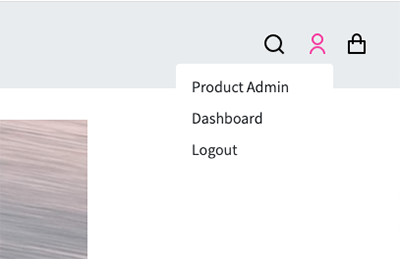
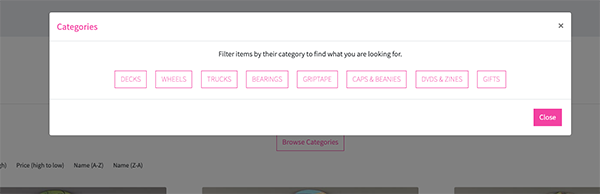
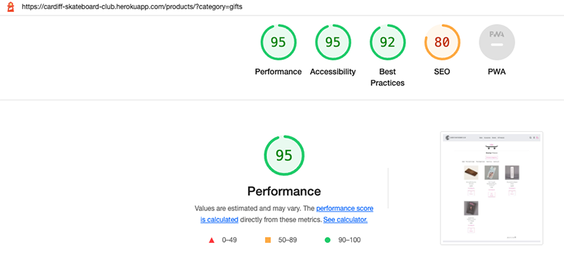
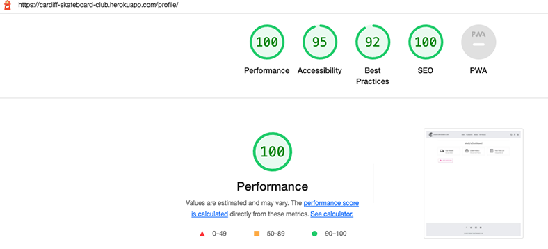
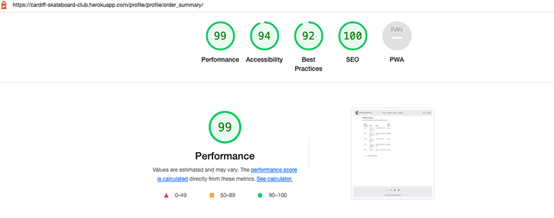
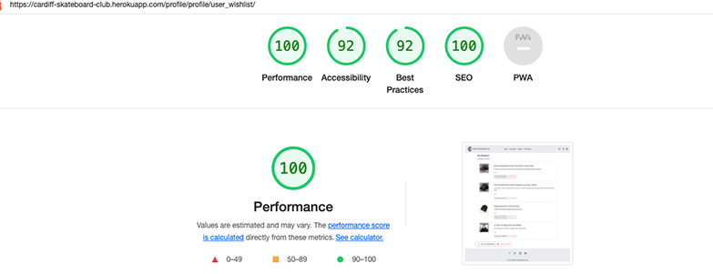
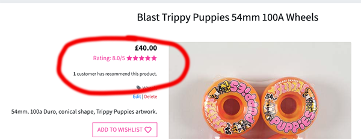
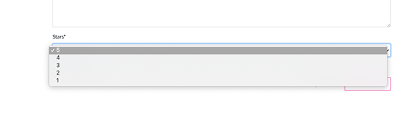
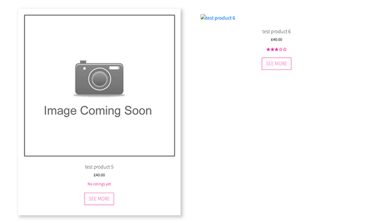

# Testing

I have tested my deployed site to ensure that it achieves the intended aims of the owner and the expectations of the users by meeting the user stories detailed in the [README.md](README.md). I have also manually tested the deployed site across a number of different devices and browsers to ensure that the design, layout and functionality respond as intended. In addition the validity of my HTML, CSS, Javascript and Python code have been checked using the [W3C Markup](https://validator.w3.org/) , [CSS Validation Service](https://jigsaw.w3.org/css-validator/), [JSONLint](https://jsonlint.com/) and [PEP8]( https://pypi.org/project/pep8/) respectively. Finally I have used [Lighthouse](https://developers.google.com/web/tools/lighthouse) in Chrome DevTools to test the accessibility and performance of my site. The specific tests and results are detailed below:

## __Table of Contents__
1. [User Stories](#user-stories)
2. [Manual Functionality Testing](#manual-functionality-testing)
3. [Responsiveness](#responsiveness)
4. [Lighthouse Testing](#lighthouse-testing)
5. [Automated Testing](#automated-testing)
6. [Bugs and Errors](#bugs-and-errors)


## User Stories

### ___As a new user I want to:___

* __Quickly and easily understand the purpose of the site to decide if I want to stay__
    * Introductory paragraph underneath the hero image introduces the site and explains its purpose
    * Hero images and site logo show the site's purpose.


* __Have clear navigation tools to move around the site to find what I am looking for easily__
    * Clear navigation bar at the top each page containing links to the products.    

      

    * Icons in the top right corner of the navbar, provide quick navigation to key areas, bag, dashboard etc      

    

    * Numerous navigation buttons on various pages allowing users to find their way around the site
    * Back to top button on the products page allows users to return to the top of the page quickly       

           

    * Dropdown menus used to keep screen 'clutter' to a minimum.

* __Be able to browse the full range of available products to decide if there is something I wish to purchase__
    * Products page allows users to browse the full range of products.
    
* __Be able to filter the products by their specific categories or brands so I can browse a particular brand or category I am looking for__
    * Filter buttons allows users to filter the results by category or brand and find the items they are interested in quickly.  

         

* __Search for items in the shop by their name or description so I can easily find items I am looking for__
    * Users are able to click the search icon on all pages and search through the product range by name and description   

         

* __Sort the items in the shop by price, name, brand and category to find items within my budget, or within my desired brand/category__
    * Convenient icon selectors on mobile and filter buttons on desktop allow users to determine the order in which the products are listed  

            

* __View individual product details to decide if a product meets my needs.__
    * Users can view the specifics of individual products on the product details page.
    * Price, product details and other information presented clearly to the customer.   

           

* __See product reviews and ratings from other users, so I can buy an item with confidence.__
    * On the products page users can see the average rating of each product (if it has been rated)
    * On the product details page users can see the ratings, and how many customers have recommended the product.
    * Users can also read individual review in full, and see how recent they are.    

             

* __Add items to my bag easily so that I can continue to browse the store and make further purchases.__
    * On the products detail page users have the option to add items to their back with one click.
    * Users can then either continue shopping or checkout.

* __View my bag, and make adjustments to it before I check out, to enjoy a convenient and pleasant experience.__
    * On adding items to their bag Users receive a confirmation message with a link to view their bag.    

          

    * Users can access the bag at any time form the navigation bar.
    * Users have the option to increase the amount of items in their bag easily.
    * Users can also remove items completely.    

           

* __Create an account easily so I cake purchases and save my details for future use.__
    * Django allauth allows users to quickly and easily create an account
    * Users need only provide a username, email and password to create an account
    * When users make a subsequent purchase they have the option to save their details to their account    


* __Have my performed actions confirmed to me so I am sure my intended action was completed.__    
    * Confirmation messages shown to the users following key user actions e.g adding items to bag, signing in and out, adding items to a wishlist    

    
### ___As a registered user I also want to:___

* __Easily log in or out so I can view my personal profile__
    * Users can login or out of the site with a few simple clicks.    

        

    * confirmation message shown to the user to confirm their action
    * Personal dashboard is linked from the users icon in the main navbar    
    

* __Be able to save and remove items to a wishlist so I can decide if I want purchase them later__
    * Users are able to quickly add and remove items on their wishlist from the product detail page.    

         

    * Filled heart icon shows the user quickly if the item is in their wishlist
    * Confirmation message given to the user on adding an item to their wishlist along with an invitaion to view the wishlist.
    * Users can view their complete wishlist from the user dashboard    

* __View and edit my delivery and account details to ensure my details are correct__
    * From the dashoard users can view their personal details and edit them.    

         

* __Leave a product review__
    * Registered users who are signed in can leave a review of a chosen product
    * Users are able to give te product a rating and a reccomendation to inform their fellow customers    

         

* __Edit my reviews so that I can ensure the reviews are correct__
    * Users can subsequently edit a review from the product detail page.
    * Users can only edit a review that they left    

     

* __View my purchase history so I can keep track of past orders__
    * In their dashboard users can view their order history.
    * Users can see all past orders and speciic details of individual orders    

     

* __Receive confirmation emails following a purchase so I know the purchase was successful__
    * Users are sent a confirmation email to their account email address following a succesful purchase.

### ___As the site owner I want:___

* __Be able to add, edit or delete products to keep the store updated__
    * Admin users can edit and delete products from the individual product detail page    

         

    * Admin users can add new products in the product admin section.    

         

* __Ensure that only superusers are able to add, edit or delete products in order to maintain control of the items in the store.__
    * This functionality is exclusive to superusers and has been ensured programatically in the back-end.
    * Warning messages given to users who try to force entry to restricted pages.    

* __Be able to edit or delete a users review in case it may be inappropriate or unfair.__
    * Only Admin users are able to delete reviews again this has been ensured programatically in the back-end.
    * Admin Users can also edit any review        

          

     &nbsp; &nbsp; &nbsp; &nbsp; &nbsp; &nbsp; &nbsp; &nbsp; &nbsp; &nbsp; &nbsp; &nbsp; &nbsp; &nbsp; &nbsp; &nbsp; &nbsp; &nbsp; &nbsp; &nbsp; &nbsp; &nbsp; &nbsp; &nbsp;&nbsp; &nbsp; &nbsp; &nbsp; &nbsp; &nbsp; &nbsp; &nbsp; &nbsp; &nbsp; &nbsp; &nbsp; &nbsp; &nbsp; &nbsp; &nbsp; &nbsp; &nbsp; &nbsp; &nbsp; &nbsp; &nbsp; &nbsp; &nbsp; &nbsp; &nbsp; &nbsp; &nbsp; &nbsp; &nbsp; &nbsp;[Back to Top](#table-of-contents)

## Manual Functionality Testing

### Base Template
| Test Condition                                                                               | Result |
|----------------------------------------------------------------------------------------------|--------|
| CSC navbar logo links to the homepage                                                        | Pass   |
| Navbar dropdown links take users to the products                                             | Pass   |
| Each navbar link filter the products correctly                                               | Pass   |
| When not logged in, user icon links show 'register' and 'login'                              | Pass   |
| When logged in, user icon links show 'dashboard' and 'logout'                                | Pass   |
| When an admin user is logged in, user icons also show product management link                | Pass   |
| Bag icon links to the bag page                                                               | Pass   |
| Search bar icon reveals the hidden search bar                                                | Pass   |
| Search bar functions correctly and finds items by 'name'                                     | Pass   |
| Search bar functions correctly and finds items by 'description'                              | Pass   |
| If items found correct message shows No of items found for the search term                   | Pass   |
| If no items are found, correct message shows 0 items found                                   | Pass   |
| If no search criteria entered, warning message shown and user returned to the products page  | Pass   |

### Homepage 
| Test Condition                                                                   | Result |
|----------------------------------------------------------------------------------|--------|
| Shop Now' button in the introductory paragraph links to the products page        | Pass   |
| The 'see more' link in the introductory paragraph links to the about CSC section | Pass   |
| The 3 product image containers fade on hover and reveal the corect button        | Pass   |
| The 3 product imagebuttons link correctly to the relevant products               | Pass   |

### Products Page
| Test Condition                                                                                                     | Result |
|--------------------------------------------------------------------------------------------------------------------|--------|
| Correct brand or category name rendered at top of page above skateboard png                                        | Pass   |
| Browse Categories button launches the modal correctly                                                              | Pass   |
| Modal product filtering buttons works correctly for each given criteria                                            | Pass   |
| Product filtering buttons works correctly for each given criteria                                                  | Fail   |
| Links change color to pink on hover                                                                                | Pass   |
| Solid pink border shown on the active link                                                                         | Pass   |
| Show 'all products' link works correctly                                                                           | Pass   |
| text shows correct number of products being filtered                                                               | Pass   |
| Hover shadow effect works correctly on each individual product container                                           | Pass   |
| Correct image shown for each product                                                                               | Pass   |
| If no image available temporary image is shown                                                                     | Pass   |
| Rating stars render correctly for each individual product                                                          | Pass   |
| Correct text displayed if the product has no ratings                                                               | Pass   |
| The 'See More' button links correctly to the product details page                                                  | Pass   |
| The Back to Top button, sends the user back to the top of the page                                                 | Pass   |

### Product Details Page
| Test Condition                                                                                                                     | Result |
|------------------------------------------------------------------------------------------------------------------------------------|--------|
| Correct image shown for each product                                                                                               | Pass   |
| If no image available temporary image is shown                                                                                     | Pass   |
| Rating stars average and associate text are showing correctly                                                                      | Pass   |
| Correct text displayed if no product has no ratings                                                                                | Pass   |
| Number of customers who have recommended the product is showing correctly                                                          | Pass   |
| Correct text displayed if no product has no reccomendations                                                                        | Pass   |
| Correct category tag is displaying, and links to the correct category                                                              | Pass   |
| Only superusers are able to add/delte the products                                                                                 | Pass   |
| Info message generated when a superuser starts to edit a product                                                                   | Pass   |
| Edit product functionality works as expected                                                                                       | Pass   |
| Success message generated when a user has succesfully edited a product                                                             | Pass   |
| User is then returned to the product detail page                                                                                   | Pass   |
| Updated product details shown correctly in the product detail template                                                             | Pass   |
| Form validation checks generate a warning message and prevent the form from submitting the form                                    | Pass   |
| If user enteres incorrect information in the form but it meets the validation checks, warning message given and form not submitted | Pass   |
| When the user clicks the delete button the delete modal fires.                                                                     | Pass   |
| Cancel button on the modals closes it and returns user to the product detail template                                              | Pass   |
| Delete button on the modals deletes the product and returns user to the product template                                           | Pass   |
| On deleteing the product user is given a confirmation message                                                                      | Pass   |
| If deleteing a product with an associated review the product and the review are deleted without issue                              | Pass   |
| If deleteing a product which is in a users wishlist both are deleted without issue                                                 | Pass   |
| If a user is not a super user the links are not shown                                                                              | Pass   |
| Clicking the wishlist button adds the product to a users wishlist if user logged in, and heart icon turns solid                    | Pass   |
| Clicking the wishlist button again removes the product from a users wishlist if user logged in, and heart icon shows an outline    | Pass   |
| Correct confirmation message shown to the user for each action                                                                     | Pass   |
| If the user tries to add an item when not logged in they are directed to the login page                                            | Pass   |
| Quantity selector buttons allow the user to add the correspending number of items to their bag                                     | Pass   |
| Confirmation message with a snapshot of the bag is shown to the user                                                               | Pass   |
| The 'View Bag' button in the message snapshot sends user to the bag page.                                                          | Pass   |
| The 'Keep Shopping' button sends the user back to the products page                                                                | Pass   |
| Authenticated users are able to add a review.                                                                                      | Pass   |
| Authenticated users can only add one review per product.                                                                           | Pass   |
| Correct warning message shown to users if they try to add a dupicate review                                                        | Pass   |
| Review form inputs work as expected and dropdowns show the correct values                                                          | Pass   |
| On submitting the review, user given a confirmation message                                                                        | Pass   |
| The new review is shown correctly in the review box.                                                                               | Pass   |
| User reviews are ordered correctly, with the most recent first                                                                     | Pass   |
| Rating stars, user name and how long ago the review was left are showing correctly                                                 | Pass   |
| Review text is shown correctly                                                                                                     | Pass   |
| Product recommendation shown correctly with the correct Icon.                                                                      | Pass   |
| Superusers are able to edit and delete any reviews                                                                                 | Pass   |
| Delete modal functionality works correctly                                                                                         | Pass   |
| Delete review functionality works correctly                                                                                        | Fail   |
| Edit review functionality works correctly                                                                                          | Pass   |
| Confirmation messages provided correctly                                                                                           | Pass   |
| Review owners are able to edit reviews                                                                                             | Pass   |
| Unauthenticated users are not able to leave a review or to edit/delete an existing one.                                            | Pass   |
| Unauthenticated users are shown a message that they should sign in to leave a review                                               | Pass   |

### Bag Page
| Test Condition                                                                          | Result |
|-----------------------------------------------------------------------------------------|--------|
| Correct items showing in the users bag                                                  | Pass   |
| Plus and minus icons increase and decrease the Qty number on each click                 | Pass   |
| Correct image shown for each product                                                    | Pass   |
| If no image available temporary image is shown                                          | Pass   |
| Correct product name, code and price shown for each item                                | Pass   |
| Update button updates the bag content correctly                                         | Pass   |
| Remove button completely removes all items                                              | Pass   |
| The 'Keep Shopping' button returns user to the products page                            | Pass   |
| Correct subtotal shown for the totals of each item                                      | Pass   |
| Correct bag total amount showing                                                        | Pass   |
| Correct delivery total shown if delivery charge applicable                              | Pass   |
| If delivery charge, message showing how much more spend required to get free delivery   | Pass   |
| Delivery charge is 0 if no delivery charge applicable                                   | Pass   |
| Grand total is correct for singular and multiple items if delivery charge applicable    | Pass   |
| Grand total is correct for singular and multiple items if no delivery charge applicable | Pass   |
| The 'Secure Checkout' button takes users to the checkout page                           | Pass   |

### Checkout Page
| Test Condition                                                                              | Result |
|---------------------------------------------------------------------------------------------|--------|
| Order summary section displaying correct number of items being purchased                    | Pass   |
| Order summary displaying the correct product information for each item                      | Pass   |
| Correct product image showing                                                               | Pass   |
| If no image available temporary image is shown                                              | Pass   |
| Correct subtotal shown for the totals of each item                                          | Pass   |
| Correct bag total amount showing                                                            | Pass   |
| Correct delivery total shown if delivery charge applicable                                  | Pass   |
| Delivery charge is 0 if no delivery charge applicable                                       | Pass   |
| Grant total is correct for singular and multiple items if delivery charge applicable        | Pass   |
| Grant total is correct for singular and multiple items if no delivery charge applicable     | Pass   |
| Checkout form renders correctly                                                             | Pass   |
| Detail fields are both showing correctly                                                    | Pass   |
| Delivery fields are all showing correctly                                                   | Pass   |
| If the user is authenticated and has saved details previously details are pre-filled        | Pass   |
| Form validation working correctly                                                           | Pass   |
| User has the option to save any changes in their details to their profile page              | Pass   |
| If user in not authenticated, message shows login/create account link in order to save info | Pass   |
| Warning message displays how much users card will be charged                                | Pass   |
| Adjust Bag' link takes user back to the bag page                                            | Pass   |
| Complete Order' button triggers the payment process                                         | Pass   |
| Payment processing message and spinner appear while the payment is processed                | Pass   |
| Confirmation message shown to the user if order is successful                               | Pass   |
| Stripe webhooks are successfully processed                                                  | Pass   |
| If an invalid card number entered, warning message is shown                                 | Pass   |
| If webhook disabled and payment cannot be processed, error message is shown                 | Pass   |

### Checkout Successs Page
| Test Condition                                                          | Result |
|-------------------------------------------------------------------------|--------|
| Message showing that a confirmation email was sent to the user is shown | Pass   |
| Order summary details are rendered                                      | Pass   |
| All information shown correctly according to the order                  | Pass   |
| Product name links back to the product detail page                      | Pass   |
| Order total and delivery costs are shown correctly                      | Pass   |
| The 'Keep Shopping' button takes user back to the products page         | Pass   |
| Confirmation email received correctly                                   | Pass   |

### User Dashboard
| Test Condition                                                                                    | Result |
|---------------------------------------------------------------------------------------------------|--------|
| User Dashboard Page shows three areas available to the user (details, order history and wishlist) | Pass   |
| User Dashboard Page shows displays the users name correctly in the heading                        | Pass   |
| Icons, title and outline turn pink on hover                                                       | Pass   |
| Each link takes the user to the correct page                                                      | Pass   |

### User Details
| Test Condition                                                                     | Result |
|------------------------------------------------------------------------------------|--------|
| User details form shown to the user with their stored information                  | Pass   |
| Users able to update the infomation                                                | Pass   |
| If the user has not saved details previously all details will be blank             | Pass   |
| New users able to add and save details                                             | Pass   |
| Confirmation message shown to the users to confirm that their details were updated | Pass   |
| Back to Dashboard' link directs user to the dashboard                              | Pass   |

### Order History
| Test Condition                                                              | Result |
|-----------------------------------------------------------------------------|--------|
| If no past orders, message shown to confirm and a link to the products page | Pass   |
| If past orders, orders shown in a table                                     | Pass   |
| Order number links to the Order Summary for that order                      | Pass   |
| Order summary displays correctly as on the checkout success page            | Pass   |
| Back to dashboard link shown as user came from dashboard.                   | Pass   |
| Back to dashboard link sends user back to the dashboard.                    | Pass   |
| Confirmation message shown to the user to show this is a past order.        | Pass   |

### Wishlist
| Test Condition                                                             | Result |
|----------------------------------------------------------------------------|--------|
| If products in wishlist, products information shown correctly              | Pass   |
| Correct product image showing                                              | Pass   |
| If no image available temporary image is shown                             | Pass   |
| Button to 'View Product' displaying and links to the correct product       | Pass   |
| Button to 'Remove from Wishlist' displaying and removes item from wishlist | Pass   |
| Confirmation message shown when item removed from wishlist                 | Pass   |
| If no items in wishlist, message informing user is displayed               | Pass   |
| Back to Dashboard' Button displayed and links to the dashboard             | Pass   |
| Keep Shopping' Button displayed and links to the products page             | Pass   |

### Product Admin
| Test Condition                                                                      | Result |
|-------------------------------------------------------------------------------------|--------|
| Product Admin menu link only available to superusers                                | Pass   |   
| Non superusers prevented from forcing acces to the page                             | Pass   |   
| Error message shown to non superusers when doing so                                 | Pass   |   
| Add Product Form displays all relevant fields                                       | Pass   |   
| Form controls prevent invalid inputs                                                | Pass   |   
| Adding a new product without an image delivers expected result with temporary image | Pass   |  
| After adding the product user shown the product details page for that product       | Pass   |  
| Confirmation message confirms product added successfully                            | Pass   |  

### Login and Logout
| Test Condition                                                                      | Result |
|-------------------------------------------------------------------------------------|--------|
| Users are able to login to the site without issue                                   | Pass   |   
| Users are able to log outr of thwe site without issue                               | Pass   |   
| Confirmation displayed to the user upon succesfully signing in                      | Pass   |   
| Confirmation displayed to the user upon succesfully signing out                     | Pass   |
| Confirmation email sent to new users                                                | Pass   |
| All other All auth features are working correctly                                   | Pass   |      

&nbsp; &nbsp; &nbsp; &nbsp; &nbsp; &nbsp; &nbsp; &nbsp; &nbsp; &nbsp; &nbsp; &nbsp; &nbsp; &nbsp; &nbsp; &nbsp; &nbsp; &nbsp; &nbsp; &nbsp; &nbsp; &nbsp; &nbsp; &nbsp;&nbsp; &nbsp; &nbsp; &nbsp; &nbsp; &nbsp; &nbsp; &nbsp; &nbsp; &nbsp; &nbsp; &nbsp; &nbsp; &nbsp; &nbsp; &nbsp; &nbsp; &nbsp; &nbsp; &nbsp; &nbsp; &nbsp; &nbsp; &nbsp; &nbsp; &nbsp; &nbsp; &nbsp; &nbsp; &nbsp; &nbsp;[Back to Top](#table-of-contents)     


## Responsiveness

The site has been designed with a mobile first approach, and great care has been taken throughout the development process to ensure that the site responds well across all viewing devices. Bootstrap ‘breakpoints’ have been adhered to ensure consistency in the design layouts, and this has been extensively tested using [ChromeDevTools]( https://developer.chrome.com/docs/devtools/) both throughout development and on completion of the build. Some custom CSS media queries have been used to improve the responsiveness of the design reducing padding as appropriate and to allow some text to fit neatly within the design space as intended. e.g

```
/* following media query to reduce font size on smaller screens */

@media (max-width: 400px) {
    .add-review-container {
        padding: 4px !important;
    }
} 
```
I have tested my site across various screen widths in order to best replicate the breadth of modern viewing devices, and in line with the Bootstrap breakpoints that were used in the design, namely:

    Extra Small <576px
    Small 576-768px
    Medium 768-992px
    Large 992-1200px
    Extra Large >1200px

Additional testing was carried out on the physical devices that I have access to:
 
    A large screen desktop
    Laptop
    Tablet
    Mobile device

And on the following browsers:

    Chrome
    Firefox
    Safari (ios)

Further responsiveness testing was done using [Responsinator](http://www.responsinator.com/) and [Am I Responsive](http://ami.responsivedesign.is/). No issues of concern were discovered.        

   

## Lighthouse Testing

I have tested the accessibility and performance of all pages of my deployed site using the [Lighthouse](https://developers.google.com/web/tools/lighthouse) testing tool in Chrome DevTools.     
There results were positive overall, with some areas highlighted as 'opportunities' for improvement. I noted theres and made the following changes:    
* Addfed a descriptive Meta tag to the site header.
* Reduced the size of all images to improve load times.
* Removed the hero image on mobile, now only showing the CSC logo, this has improved performance and is also more asthetically pleasing.
* Increased the resoloution of the site logo to improve accesibility score.
* Streamlined the sited CDN links and moved script links to the bottom of the base template.
* Added aria labels to buttons and more more descriptive anchor links to improve accessibility.

I ran the tests in incognito mode with all extensions disabled to provide the best possible test conditions, however there are some issues which remain unresolved at the time of submission:
* Noted vulnerability in the jQuery library
* Unused Javascript and CSS files due to Bootstrap, Font Awesome, Remixicon Jquery and Stripe.
* Issues with Render Blocking - attributable to Bootstrap and FontAwesome.
* Cache Policy issues on images. I have added a cache-policy setting in settings.py, but I believe that Lighthouse is flagging a server issue which is beyond my control.
* HTTP/2 implementation advised (over HTTP/1.1). Time constraints and the scope of the project meant I was not able to address this particular issue.
* I have also not considered issues related to Progressive Web Applications, as they fall outside the remit of this static web application. 

### Homepage        
     

### Products page        
      

### Product Detail Page          
       

### Bag Page        
     

### Checkout Page        
      

### Checkout Success Page         
       
 
### Sign-in Page         
        

### User Dashboard page       
     

### User Details Page    
     

### Order history Page    
      

### User Wishlist Page    
      

### Product Admin Page    
 

## Automated Testing

### HTML & CSS
While developing and for final checks I have validated my code using the following validation tools.

HTML - [W3C Markup](https://validator.w3.org/) was used, initially some erros and warnings were flagged. They included incorrect use of the heading hierarchy, missing closing `</div>` tags, and incorrectly nesting `<p>` tags.  All errors were addressed *(see below).   

    

CSS - [CSS Validation Service](https://jigsaw.w3.org/css-validator/)  No errors were found when I initially tested *(see below).

*__NB I performed my initial validation checks 1-2 weeks before submission, however for the two days prior to submission the W3 validation sites were down, and I was unable to perform final validation checks as I would have liked.__*     

    

As an alternative I ran final checks HTML in [Free Formatter](https://www.freeformatter.com/html-validator.html). This was not ideal and I would like to have run final check using the official w3 site. I received the following error on certain pages using this validator:   
```
Malformed byte sequence: “a3”.
At line 344, column 47
Code Extract:
```   

A google search on this error did not provide any conclusive explanations. This error was not present when using the w3 validator and with no explanation given by _Free Formatter_, and no obvious errors in the code, I am happy to ignore it.

I ran final CSS checks CSS in [WTools](https://wtools.io/validate-css-online). Again this was not ideal, and I would like to have to made the final checks using the official w3 tool. There were no errors, but some warnings were given relating to changes made by the CSS Autoprefixer. In this case and without acces to the W3 site for final confirmation I decided to ignore these warnings and allow the autoprefixer changes to remain. there were also warnings regarding the use of `!Important`, I understand these but have left them in as they are used specifically to overide Bootstrap styling, and are not causing any issues.


### PEP 8

I have tested all my python code using the [PEP8 Online](http://pep8online.com/) validation tool.    

       

I did not test the files that django creates automatically, assuming those to be error free and correct for purpose.
All of my code was PEP8 compliant, with the exception of the following 3 lines from _settings.py_ and _webhook_handler.py_ respectively which I was unable to shorten without compromising the code.

```
{
        'NAME':
        'django.contrib.auth.password_validation.UserAttributeSimilarityValidator',
    },

```    
   
```
profile.default_street_address1 = shipping_details.address.line1
profile.default_street_address2 = shipping_details.address.line2    

```

### JSHint

All Javascript files were checked using [JSHint](https://jshint.com/). `/* jshint esversion 6 */` added as a comment to let jshint know that the minimum language to target is es6.

All the filese were free from errors and warnings with the excetion of one undefined variable `Stripe` in the stripe_elements javascript file. 

### JSONLint

All my JSON fixtures files were checked with [JSONLint](https://jsonlint.com/) and were confirmed as _valid JSON_

### Django Testing Tools

I would like to have explored the django atutomated unit testing functionality more for this project. I spent some time trying to get to grips with the testing tools, using them to validate some of my form inputs in the products app. I have included some of the test I wrote below. However at this time I was pushing up against the submission deadline and realised I was not going to have the time to do this comprehensively, and achieve sufficient coverage, so I did not include it as part of my final testing. I opted to prioritise ensuring that my app was functioning as well as it could and was submitted error free. After submitting I will explore this further. 

```
from django.test import TestCase
from .forms import ProductForm

from django.test import TestCase
from .forms import ProductForm


class TestProductForm(TestCase):
    """
    Test that the product form works
    """

    def test_name_is_required(self):
        """
        Test if form submits without name field
        """
        form = ProductForm({
            'name': '',
            'description': 'test',
            'price': 'test',
            'image': 'test',
        })
        # Form should not be valid - name required
        self.assertFalse(form.is_valid())
        self.assertIn('name', form.errors.keys())
        # Check error message is correct
        self.assertEqual(
            form.errors['name'][0], 'This field is required.')

    def test_description_is_required(self):
        """
        Test if form submits without description field
        """
        form = ProductForm({
            'name': 'test',
            'description': '',
            'price': 'test',
            'image': 'test',
        })
        # Form should not be valid - description required
        self.assertFalse(form.is_valid())
        self.assertIn('description', form.errors.keys())
        # Check error message is correct
        self.assertEqual(
            form.errors['description'][0], 'This field is required.')

    def test_price_is_required(self):
        """
        Test if form submits without price field
        """
        form = ProductForm({
            'name': 'test',
            'description': 'test',
            'price': '',
            'image': 'test',
        })
        # Form should not be valid - price required
        self.assertFalse(form.is_valid())
        self.assertIn('price', form.errors.keys())
        # Check error message is correct
        self.assertEqual(
            form.errors['price'][0], 'This field is required.')

    def test_image_is_not_required(self):
        """
        Test if form submits without image field
        """
        form = ProductForm({
            'name': 'test',
            'description': 'test',
            'price': 'test',
            'image': '',
        })
        # Form should be valid - image not required
        self.assertTrue(form.is_valid())

```    

## Bugs and Errors

### __Add To Wishlist__ function not working correctly

I had incorrectly set up my __Add To Wishlist__ function. If a user was authenticated the function would work correctly, the item wuld be added to the wishlist and the correct message would be shown to the user.
When a user was not logged in and tried to add an item to the wishlist they would be correctly directed to the Login Page, however when the user then logged in it would generetae an 'endless loop' and a constant stream of alert messages which would
cause the browser to crash. After some investigation I realised that by using the following return statement:
 
```          
return HttpResponseRedirect(request.META["HTTP_REFERER"])
```         
to return the user to the page they had come from, was inadvertantly and unneccesarily causing the issue. By ammending the return statement to redirect the user to the product detail page
the issue was resolved.

```      
return redirect(reverse('product_detail', args=[product.id]))
```

### __Edit Review Form__

When adding a product review the select box for the rating stars was set with options 1-5 because I created the form in my template,
however because the __Edit Review Form__ used crispy forms which use a default type of input for each model field. In this case the user was able to enter any number for the rating stars    
    
 

and if those were outside of the specified range they would show on the review and in the average ratings thereby distorting things.    

     

 To override this I tried to add a max and min option but in the Django Docs I couldn't find a clear example for an integerfield, 
so I decided to set defined options on the model as follows:

```
STAR_OPTIONS = (
        (5, '5'),
        (4, '4'),
        (3, '3'),
        (2, '2'),
        (1, '1'),
    )
```    

Ammending the model in this way had the desired affect and means that the available options for the star rating field on the __Edit Review Form__ are as intended.    

     

### __Pagination__

I was really keen to implement a pagination feature into my site, particularly on the products page where if all the products are viewed together they number over 100, and the amount scrolling required by the user is not ideal.
By referring to the Django Documentation I was able to get this working within the products view using Django's Paginator class to group the products into page objects. I then realised that this had impacted on the product filtering and ordering that I had already implemented. I decided to stick with the option of filtering and ordering products as I belive it offeres a more convenient way for users to browse the store. Given more time it is something I am keen to explore further. Essentially as both use query paramemters a way would need to be found to run them seperately so that they did not impact each other.

### __Incorrect Product Review being deleted__

When manually testing the functionality of my site I realised that when a review owner or a superuser was deleteing a review, it was always the most recent review that was being deleted and not the one that was selected for deletion. After some investigation I discovered that because the reviews were being deleted via a Bootstrap Modal to prevent accidental deletion I hadn't ensured that the modal IDs were unique i.e that there was a unique ID for each modal linked to a review. Initially they all had the same ID, and so therefore it was always the first review that was being deleted as there was no way to distinguish between them. By adding the __review id__ to the modal id and also to the __data target__ of the button that it points to as follows:    

```
id="DeleteReviewModal-{{ review.id }}"
```
```
data-target="#DeleteReviewModal-{{ review.id }}"
```     
It ensured that the intended review was being deleted.

### __Unexpected whitespace when viewing on mobile__

When testing how the site layout was rendering on different screen sizes I became aware of unintended whitespace showing on the right hand side of some images and below the footer on pages witlimited content.    

      

 I found a post on
[Stack Overflow](https://stackoverflow.com/questions/4617872/white-space-showing-up-on-right-side-of-page-when-background-image-should-extend) that indicated it was a common issue particularly on IOS devices. I have added the following CSS    
````
html,body {

    width: 100%;
    height: 100%;
    margin: 0px;
    padding: 0px;
    overflow-x: hidden; 
}
````

which has resloved the issue.    

### __Default Image not Loading__

I caught this error when manually testing. Whenever a product image is not present, a default product image set to load using an if statement in the template, this works well and the default image is loaded if there is no image associated with that product (as seen below left). However, if for some eason the image cannot be and a 404 error is returned then the default image does not load, and the following is presented to the user (below right)    

   

In most situations the __if__ statement would catch a missing image and display the default placeholder, but as a extra precaution I have added the following attribute to the product image so that the default placeholder is loaded in the event of an error. This code was ammended from a post on [Stack Overflow](https://stackoverflow.com/questions/63038939/how-can-i-set-default-image-in-property-if-image-is-not-available-for-a-product)

```
onerror="this.onerror=null; this.src='{{ MEDIA_URL }}awaiting-image.jpeg'"      

```    

&nbsp; &nbsp; &nbsp; &nbsp; &nbsp; &nbsp; &nbsp; &nbsp; &nbsp; &nbsp; &nbsp; &nbsp; &nbsp; &nbsp; &nbsp; &nbsp; &nbsp; &nbsp; &nbsp; &nbsp; &nbsp; &nbsp; &nbsp; &nbsp;&nbsp; &nbsp; &nbsp; &nbsp; &nbsp; &nbsp; &nbsp; &nbsp; &nbsp; &nbsp; &nbsp; &nbsp; &nbsp; &nbsp; &nbsp; &nbsp; &nbsp; &nbsp; &nbsp; &nbsp; &nbsp; &nbsp; &nbsp; &nbsp; &nbsp; &nbsp; &nbsp; &nbsp; &nbsp; &nbsp; &nbsp;[Back to Top](#table-of-contents)
 

